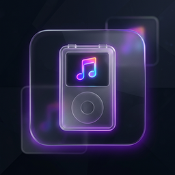

#  iPod Music Manager (SPECIFICALLY iPod Shuffle 4th Gen — For Now)

> **Note:** I am a programming newbie and this complete tool was built entirely as a passion project with the help of AI! 🤖


**A standalone iPod Shuffle 4th Generation sync manager for Windows — no iTunes required. (I do not have other iPod models to test against!)**

iPod Music Manager is a zero-dependency, self-contained tool that lets you manage music on your iPod Shuffle 4G directly. It builds the proprietary `iTunesSD` database from scratch, handles audio transcoding, generates VoiceOver speech files, and provides a modern dark-themed GUI — all without iTunes, iCloud, or any Apple software.

[](https://opensource.org/licenses/MIT)

---

## Features

- **Two Viewing Modes** — Toggle instantly between an ultra-fast raw List View and a rich, Spotify-style Grid View displaying 150x150 extracting album art thumbnails natively.
- **Multilingual VoiceOver AI** — Dynamically detects CJK (Chinese, Japanese, Korean) characters and flawlessly pipes them through Google's TTS API for high fidelity speech online. Falls back gracefully to Windows SAPI offline.
- **Universal Character Syncing** — Employs a deterministic path-obfuscator system (`F_<hash>`) to guarantee special characters sync flawlessly to the iPod Hardware without skips, while maintaining full text metadata.
- **Incremental Sync & Cache Sweeper** — Only copies new/missing files. Any unselected tracks or abandoned folders are automatically swept off the iPod physical disk completely, recovering wasted storage natively on every sync!
- **State Memory Tracking** — Remembers exactly which playlists you left collapsed/expanded or checked the previous session natively.
- **Audio Transcoding** — Built-in ffmpeg integration converts FLAC, OGG, OPUS, WMA, AIFF and more into MP3 or AAC seamlessly.
- **Parallel Processing** — Multi-threaded copy/transcode engine for significantly faster syncs.

## Requirements

- **Windows 10/11** (uses Windows SAPI for VoiceOver, dark title bar API)
- **Python 3.10+** (if running from source)
- **ffmpeg** (optional, for transcoding — auto-downloaded via script)

## Quick Start (Executable)

1. Navigate to the **Releases** tab on GitHub and download the latest `ipod_music_manager.exe`.
2. Plug in your iPod Shuffle 4G.
3. Run `ipod_music_manager.exe`.
4. Select your iPod drive and music folder.
5. Check/uncheck tracks and playlists.
6. Hit **▶ Sync to iPod**.

## Running from Source

```bash
pip install -r requirements.txt
python src/main.py
```

## Automated GitHub Actions Build

This repository includes a completely automated CI/CD pipeline integrated directly into GitHub Actions.
To broadcast a public build, tag your commits with `v*` (e.g., `git tag v1.0.1` -> `git push origin v1.0.1`) and GitHub will automatically compile the executable to your newest designated release page. 

## Repository Structure

- `src/`: The modular core application components (`ui_app.py`, `database.py`, `sync_engine.py`, `voiceover.py`, `utils.py`, `ui_theme.py`, `main.py`).
- `scripts/`: Assorted non-production helper commands like `download_ffmpeg.py` and `convert_logo.py`.
- `docs/`: Technical contextual guides mapping out how the modular system operates and internal state architecture.
- `archive/`: Old prototype `.py` files and tests from previous development sessions.
- `tests/mock_data/`: Mock iPod sandbox.

## How It Works

This application mathematically reverse-engineers the iPod Shuffle 4G's `iTunesSD` binary database format:

| Component | Description |
|-----------|-------------|
| `bdhs` (TunesSD) | 64-byte header with track/playlist counts and VoiceOver flag |
| `hths` (TrackHeader) | Index of track pointers |
| `rths` (Track) | Per-track record with filename hash, start/stop times, and dbid |
| `hphs` (PlaylistHeader) | Index of playlist pointers |
| `lphs` (Playlist) | Playlist record with type, dbid, and track index list |

VoiceOver files are generated as WAV speech in `iPod_Control/Speakable/Tracks/` and `iPod_Control/Speakable/Playlists/`, keyed by the reversed hex of each item's 8-byte `dbid`.

## File Structure on the iPod

```text
iPod_Control/
├── iTunes/
│   └── iTunesSD          ← binary database (built by iPod Music Manager)
├── Music/
│   ├── Mixed/            ← playlist folder = subfolder name
│   │   ├── song1.mp3
│   │   └── song2.mp3
│   └── ASMR/
│       └── track.m4a
└── Speakable/            ← VoiceOver audio (generated)
    ├── Tracks/
    │   └── <dbid_hex>.wav
    └── Playlists/
        └── <dbid_hex>.wav
```


## Configuration Data

User settings are saved to `~/.ipod_manager_config.json` and persist fully across launches:
- Music source folder paths
- Format targets, encoding targets, and transcode flags
- VoiceOver enable/disable
- Explicit checked/unchecked synchronization states per playlist/file
- Collapsed/expanded visibility UI elements
